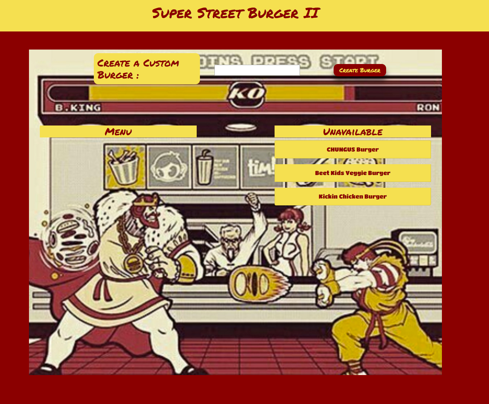

# Super Street Burger II

## Table of Contents

[Description](#description)

[Contributing](#contributing)

[Questions](#questions)

## Description

Shoryuken!

Super Street Burger II allows the user to create and devour custom burgers. Burgers are saved in a local database using mysql. The database for the live application uses JawsDB through Heroku. The application was created using Javascript, Node.JS packages: express, express-handlebars, mysql2. A custom orm was created for database use. The app follows the MVC structure. 

The application was deployed using Heroku: (https://powerful-falls-93368.herokuapp.com/)

## Contributing

Not accepting pull requests at this time.

## Questions

###### For questions, please contact me at tldavis09@yahoo.com

